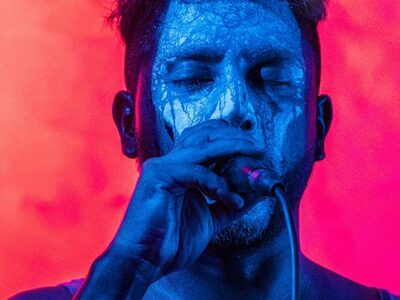
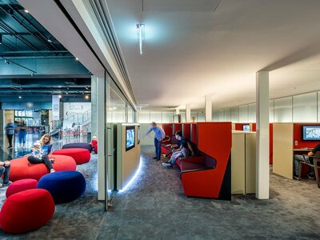
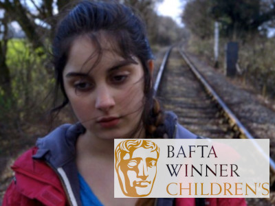

### Hi there 👋

Software developer. Web developer. Electronic Musician. DJ. Inventor of Cyril programming language.

<!--
**darrenmothersele/darrenmothersele** is a ✨ _special_ ✨ repository because its `README.md` (this file) appears on your GitHub profile.

Here are some ideas to get you started:

- 🔭 I’m currently working on ...
- 🌱 I’m currently learning ...
- 👯 I’m looking to collaborate on ...
- 🤔 I’m looking for help with ...
- 💬 Ask me about ...
- 📫 How to reach me: ...
- 😄 Pronouns: ...
- ⚡ Fun fact: ...
-->

 |  | 
---------------------|---------------------|----------------------

I’m a software developer with over 20 years experience. 
I specialise in building production-grade, scalable, frontend architectures.
I have built web apps, mobile apps, and smart TV apps. Check out my [projects](https://daz.is/projects/index.html) page for more details.
