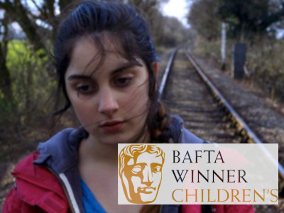

 |  | 
:---:|:---:|:---:

### Darren Mothersele

I’m a tech lead at [Flowcase](https://flowcase.com), writing Rust and building data infrastructure and integrations. I also spend time figuring out what effective collaboration with AI coding agents actually looks like when experience and judgement still matter, and [writing about it](https://daz.is/blog) as I go.

I’ve been building connective plumbing between services for 25 years: data pipelines, content migrations, search systems, APIs, web apps, the lot. That same work now extends into production AI infrastructure, where reliable agentic systems come down to the same problems of context, data, and integrations. Before all that, I co-founded a digital music startup, led the team behind the first online platform to win Channel of the Year at the BAFTA Children’s Awards, and grew from contract developer to Director of Engineering at Clue.

#### What I’m working on

- Rust in production at Flowcase, focused on data and integrations
- The [HDA guide](https://hda.daz.is), a Rust/Axum/HTMX reference that doubles as context for AI coding agents
- The [Brighton Claude Code meetup](https://luma.com/claude-code-brighton)
- [Perc](https://github.com/crabby-utils/perc) and [Memable](https://github.com/crabby-utils/memable), open source Rust tools
- [Music Instinct](https://www.musicinstinct.com/) (synth and digital music tools) and [Zero Waste Tickets](https://zerowastetickets.com/) (event ticketing)

---

Based in Brighton, UK · [daz.is](https://daz.is) · [cv@daz.is](mailto:cv@daz.is)
